# Java queue
## linked list implemenst both List & Queue
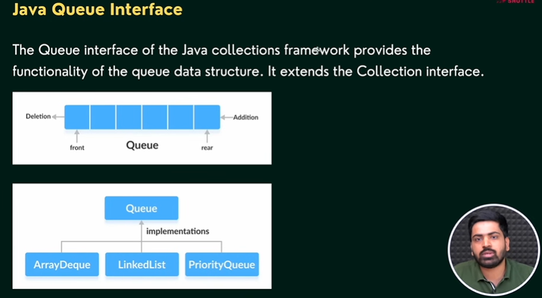
### Queue interface methods 
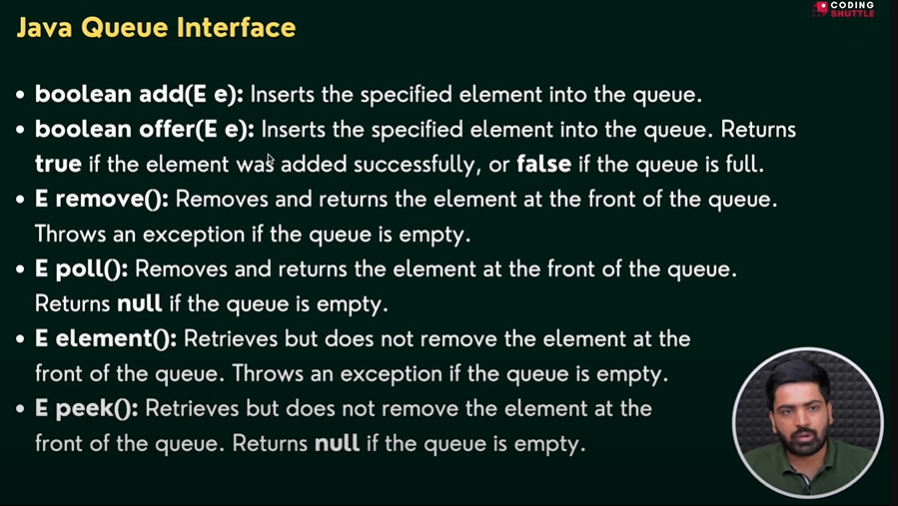
## ArrayDeque-double ended, oprations can be performed from both sides
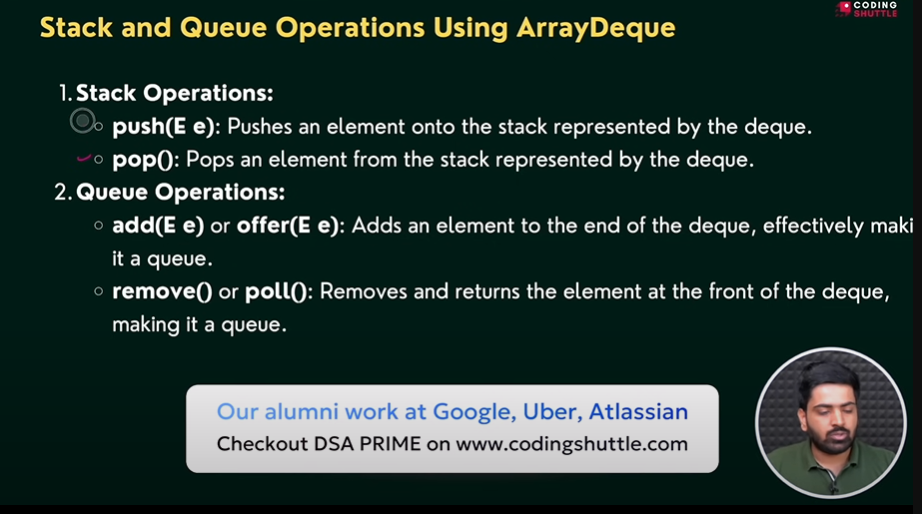
Always implement stack using ArrayDeque because stack class implements vector class which has thread-locking,synchonization 
using push and pop methodes

## ArrayDeque ->stack,linkedlist,queue,deque
and Queue operations
offer()-adds
poll()-removes
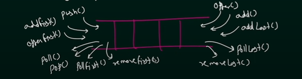

## Java set interface
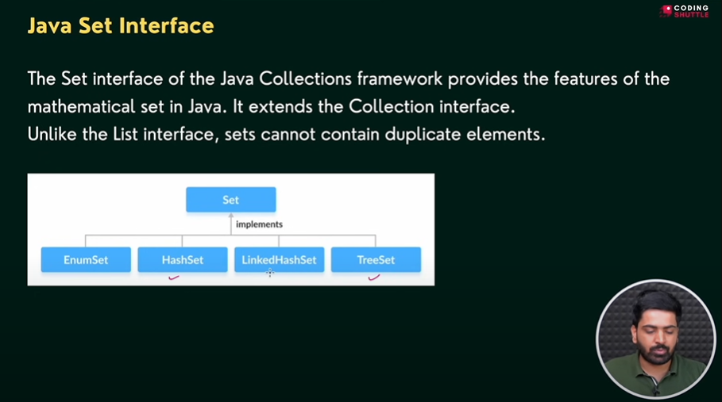
Methods of Set Interface
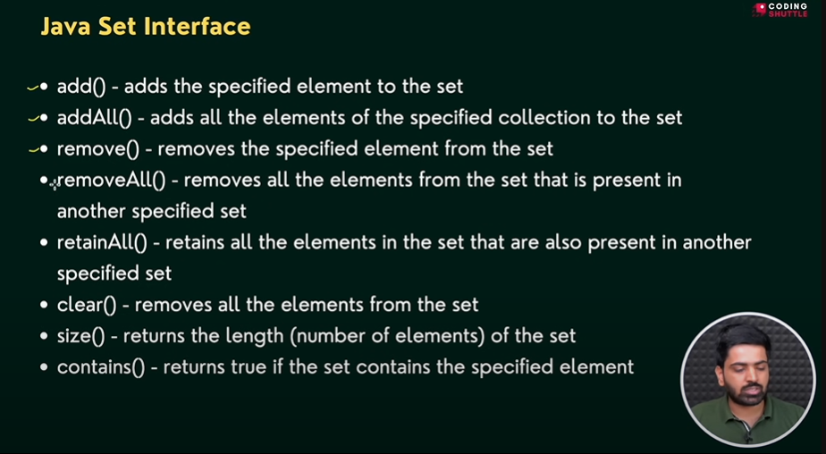

## The Map Interface
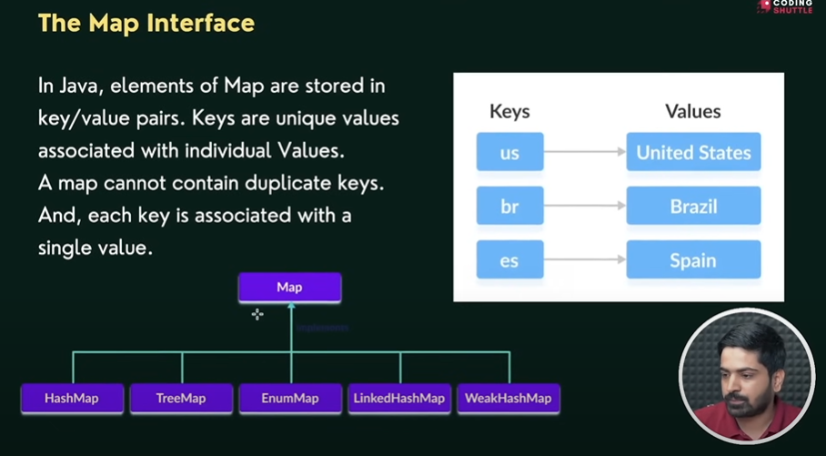
## Methods of Map
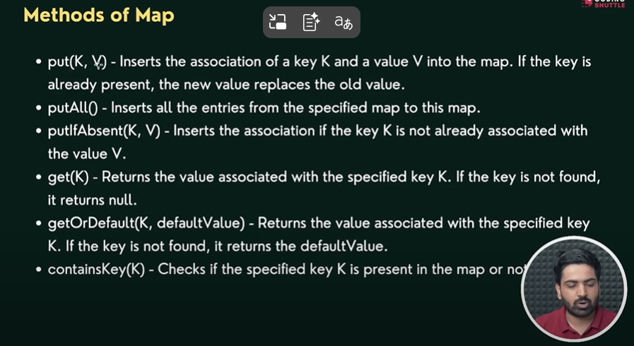
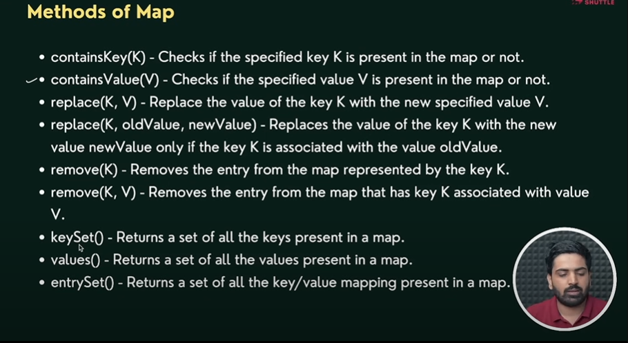
## comparables and comparators
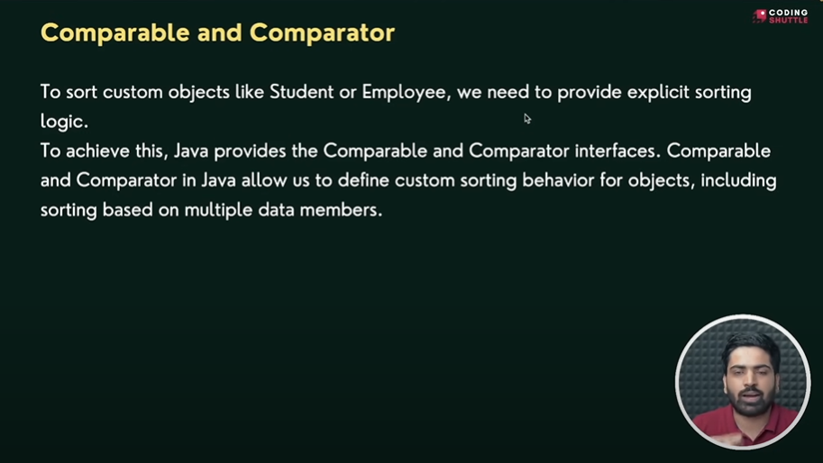
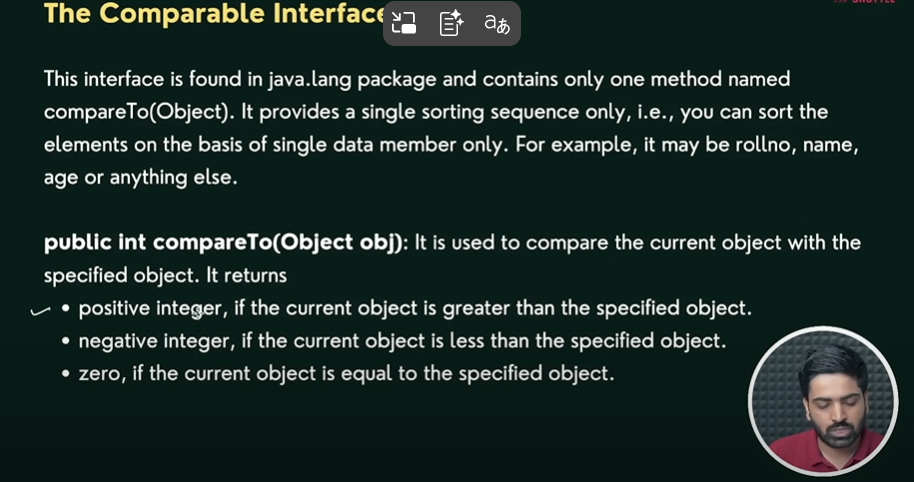